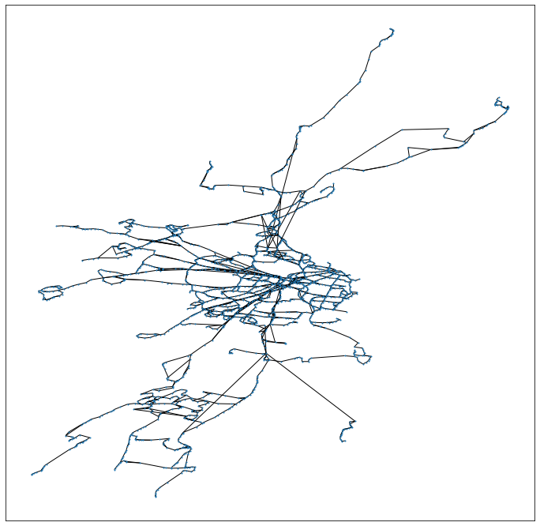

# Hyperbolic Bus Routes
Authors: Ruitao Yi, Abhirup Ghosh, Rik Sarkar

Extracting hyperbolic embeddings for Edinburgh bus transportation network

# Results

Hyperbolic plot of Edinburgh bus routes

# Dependencies

* Python 3.7
* Lxml 4.5.2
* Numpy 1.19
* Scipy 1.5.2
* Jupyter 1.0.0
* Networkx 2.4
* Pandas 1.1.0
* Mpu 0.23.1
* Joblib 0.12
* Gensim 3.8.3
* Plotly 4.9.0
* Iteration_utilities 0.10.1

# Steps:
1. Run Preprocessing.ipynb to process the data on the website
2. Run 4pc_distances.ipynb to get the 4pc-episilon plot
3. Run model.ipynb to get the hyperbolic embedding plot
